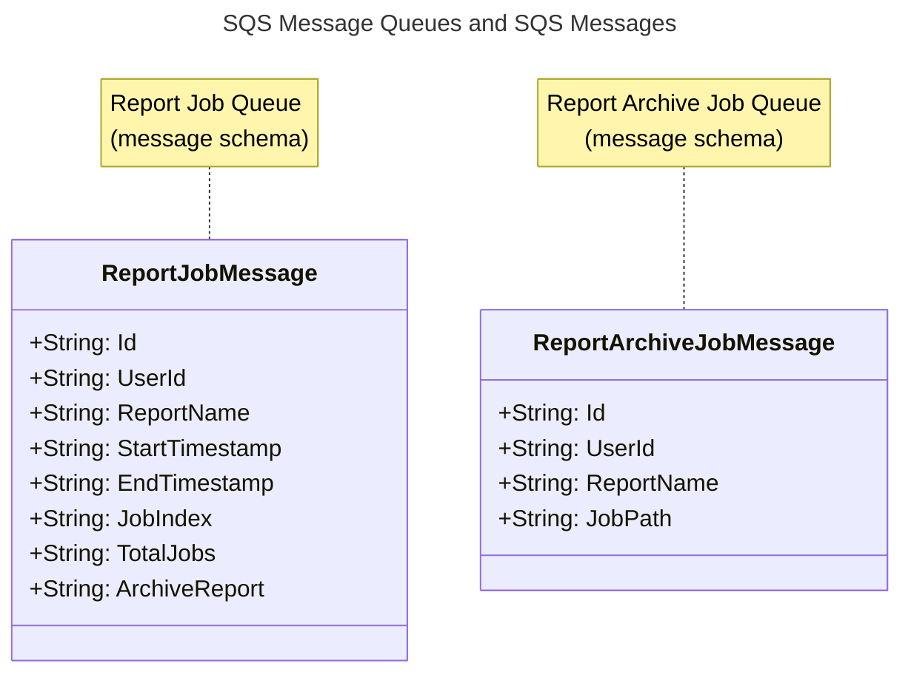
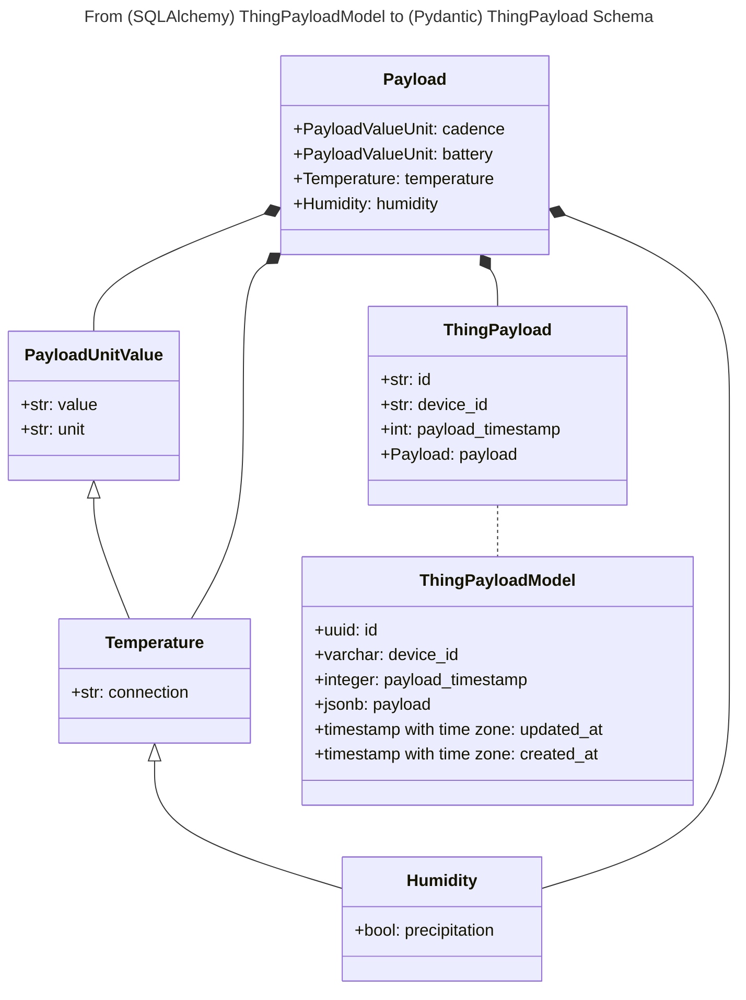
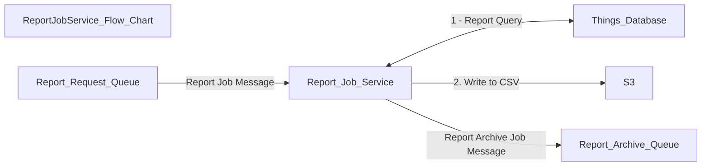
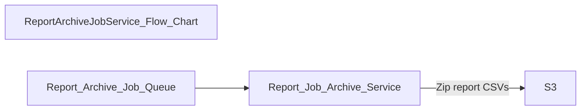

```mermaid
---
title: SQS Message Queues and SQS Messages
---

classDiagram
    class ReportJobMessage {
        +String: Id
        +String: UserId
        +String: ReportName
        +String: StartTimestamp
        +String: EndTimestamp
        +String: JobIndex
        +String: TotalJobs
        +String: ArchiveReport
    }

    note for ReportJobMessage "Report Job Queue 
    
    (message schema)"

    class ReportArchiveJobMessage {
        +String: Id
        +String: UserId
        +String: ReportName
        +String: JobPath
    }
    
    note for ReportArchiveJobMessage "Report Archive Job Queue
    
    (message schema)"
```

```mermaid
---
title: From (SQLAlchemy) ThingPayloadModel to (Pydantic) ThingPayload Schema
---

classDiagram
    class PayloadUnitValue {
        +str: value
        +str: unit
    }

    class Temperature {
        +str: connection
    }
    
    class Humidity {
        +bool: precipitation
    }
    
    class Payload {
        +PayloadValueUnit: cadence
        +PayloadValueUnit: battery
        +Temperature: temperature
        +Humidity: humidity
    }
    
    class ThingPayload {
        +str: id
        +str: device_id
        +int: payload_timestamp
        +Payload: payload
    }
    
    class ThingPayloadModel {
        +uuid: id
        +varchar: device_id
        +integer: payload_timestamp
        +jsonb: payload
        +timestamp with time zone: updated_at
        +timestamp with time zone: created_at
    }
    
    PayloadUnitValue <|-- Temperature
    Temperature <|-- Humidity
    
    Payload *-- PayloadUnitValue
    Payload *-- Temperature
    Payload *-- Humidity
    Payload *-- ThingPayload
    
    ThingPayload .. ThingPayloadModel
```

```mermaid
flowchart LR

ReportJobService_Flow_Chart

Report_Request_Queue -->|Report Job Message| Report_Job_Service <-->|1 - Report Query| Things_Database
Report_Job_Service -->|2. Write to CSV| S3
Report_Job_Service -->|Report Archive Job Message| Report_Archive_Queue
```

```mermaid
flowchart LR

ReportArchiveJobService_Flow_Chart

Report_Archive_Job_Queue -->Report_Job_Archive_Service -->|Zip report CSVs| S3
```