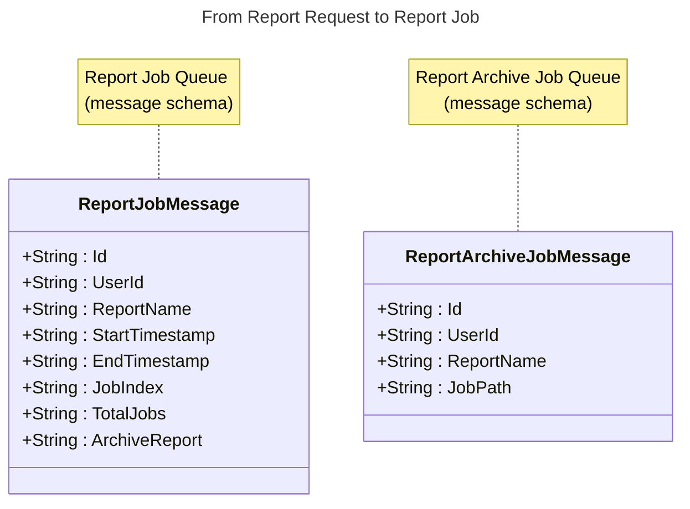
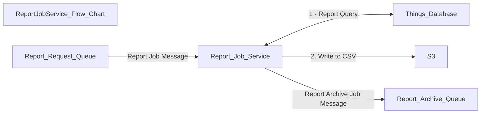
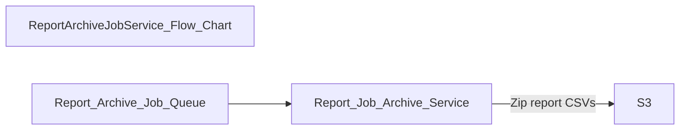

```mermaid
---
title: From Report Request to Report Job
---

classDiagram
    class ReportJobMessage {
        +String : Id
        +String : UserId
        +String : ReportName
        +String : StartTimestamp
        +String : EndTimestamp
        +String : JobIndex
        +String : TotalJobs
        +String : ArchiveReport
    }

    note for ReportJobMessage "Report Job Queue 
    
    (message schema)"

    class ReportArchiveJobMessage {
        +String : Id
        +String : UserId
        +String : ReportName
        +String : JobPath
    }
    
    note for ReportArchiveJobMessage "Report Archive Job Queue
    
    (message schema)"
```

```mermaid
flowchart LR

ReportJobService_Flow_Chart

Report_Request_Queue -->|Report Job Message| Report_Job_Service <-->|1 - Report Query| Things_Database
Report_Job_Service -->|2. Write to CSV| S3
Report_Job_Service -->|Report Archive Job Message| Report_Archive_Queue
```

```mermaid
flowchart LR

ReportArchiveJobService_Flow_Chart

Report_Archive_Job_Queue -->Report_Job_Archive_Service -->|Zip report CSVs| S3
```